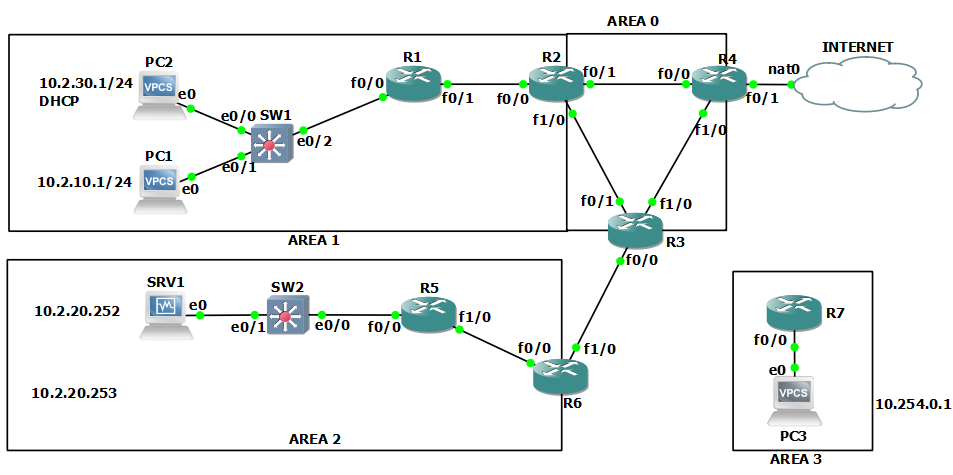

# MONTAGNIER Yrlan - Pôle réseau
## Prérequis 

A minima :
 
* Un GNS3 fonctionnel
* iOS Cisco routeur
  * c'est avec un [c3745](https://drive.google.com/drive/folders/1hnOwFTcEYeznsBwjFCzKbDripnCLOJSQ)
  * ou un [c7200](https://drive.google.com/drive/folders/17F80VfaHEMKWLHRc9aHn60AmjizXeb-R) si votre PC tient la route
* [IOU L2 Cisco](https://www.gns3.com/marketplace/appliance/iou-l2)
  * si juste l'import de cette appliance ne marche pas, vous pouvez directement download le `.bin` [drive de téléchargement](https://drive.google.com/drive/folders/1LBIlztgGVAk4XsAeovKb1JHBrRg8QPSz).
* une machine CentOS7 prête à être clonée
  * pour tous les services qui tournent sous GNU/Linux

## Architecture réseau 

L'archi que vous pouvez utiliser : 


**Tableau des réseaux utilisés**

| Réseau   | Adresse         | VLAN | Description  | Machines      |
| -------- | --------------- | ---- | ------------ | ------------- |
| `admin`  | `10.2.10.0/24`  | 10   | Admin        | `PC1`         |
| `web`    | `10.2.20.0/24`  | 20   | WEB          | `SRV1`,`SRV2` |
| `remote` | `10.254.0.0/16` | x    | IPsec        | `PC3`         |
| `users`  | `10.2.30.0/24`  | 30   | Utilisateurs | `PC2`         |


| Matériel/port   | Adresse IP        | Passerelle          |
| --------------- | ----------------- | ------------------- |
| `SRV1`          | `10.2.20.252/24`  | `10.2.20.254/24`    |
| `SRV2`          | `10.2.20.253/24`  | `10.2.20.254/24`    |
| `PC1`           | `10.2.10.1/24`    | `10.2.10.254/24`    |
| `PC2`           | `10.2.30.1/24`    | `10.2.30.254/24`    |
| `PC3`           | `10.254.0.1/16`   | `10.254.255.254/16` |
| `R1` - Fa0/0.10 | `10.2.10.254/24`  |                     |
| `R1` - Fa0/0.30 | `10.2.30.254/24`  |                     |
| `R1` - Fa0/1    | `192.168.10.1/30` |                     |
| `R2` - Fa0/0    | `192.168.10.2/30` |                     |
| `R2` - Fa0/1    | `192.168.20.1/30` |                     |
| `R2` - Fa1/0    | `192.168.30.1/30` |                     |
| `R3` - Fa0/0    | `192.168.50.1/30` |                     |
| `R3` - Fa0/1    | `192.168.30.2/30` |                     |
| `R3` - Fa1/0    | `192.168.40.1/30` |                     |
| `R4` - Fa0/0    | `192.168.20.2/30` |                     |
| `R4` - Fa1/0    | `192.168.40.2/30` |                     |
| `R5` - Fa0/0    | `10.2.20.254/24`  |                     |
| `R5` - Fa1/0    | `192.168.60.2/30` |                     |
| `R6` - Fa0/0    | `192.168.60.1/30` |                     |
| `R6` - Fa1/0    | `192.168.50.2/30` |                     |


> **Seuls les `Users` ont besoin de DHCP.**
>
>[IPhelpers](https://neptunet.fr/relais-dhcp/) nécéssaires 


- **Serveurs**
    - SRV1 : DNS + DHCP
    - SRV2 : WEB

## _Sujets communs_ 

- :seedling: Dans ce réseau routé dynamiquement, lister et associer le rôle des routeurs. 
(Rappel des rôles [ici](https://gitlab.com/thystips/pole-reseau/-/blob/master/Cours/Approfondissement/1.OSPF.md))
    - `R4` est le **routeur ASBR**
    - `R2`, `R3` et `R4` sont des **`Area Border Router` et des `Backbone Router`.**
    - `R1`, `R5` et `R7` sont des **routeurs interne.**

- :seedling: Déployez cette topographie

HINTS : 
#### Conf DHCP

* Serveur CentOS7
* Installer le paquet `dhcp`
    * `$ yum install dhcp`
* Configurer `/etc/dhcp/dhcpd.conf`
  * :file_folder: **Ma config :** [`dhcpd.conf`](./conf/DHCP/dhcpd.conf)
* démarrer le service `dhcpd`
    * `$ systemctl start dhcpd`

Tester avec un client la récupération d'un IP et l'addresse de la passerelle, (et adresse de serveur DNS).
```
PC2> ip dhcp
```

#### Conf DNS

* installer les paquets `bind` (serveur DNS) et `bind-utils` (outils DNS)
    * `$ yum install bind`
* configurer le serveur DNS en suivant les exemples de configuration
  * :file_folder: **Mon fichier :** [`named.conf`](./conf/DNS/named.conf)
    * fichier de configuration de bind
  * :file_folder: **Mon fichier :** [`dnsdomip.db`](./conf/DNS/dnsdomip.db)
    * fichier de zone
    * détermine quels noms de domaine seront traduisibles en IP
  * :file_folder: **Mon fichier :** [`dnsipdom`](./conf/DNS/dnsipdom.db)
    * fichier de zone inverse
    * détermine quelles IPs pouront être traduites en noms de domaine

Testez la résolution de noms :
* avec [dig](#nslookup-ou-dig)
* ou de simples `ping <NAME>` depuis les VPCS de GNS

#### Conf serveur web

* installer le paquet `epel-release` puis `nginx` 
    ```
    $ yum install epel-release -y; $ yum install nginx -y
    ```
* démarrer le service `nginx`
    * `systemctl start nginx`
* ouvrir le port `80/tcp`
    ```
    [root@dhcp ~]# firewall-cmd --add-port=80/tcp --permanent
    success
    [root@dhcp ~]# firewall-cmd --reload
    success
    ```
Tester que les clients accèdent correctement au site Web.
* vous pouvez utiliser un client CentOS7

#### Router dynamiquement à travers un VPN

[Encapsulation dans tunnel GRE](https://cisco.goffinet.org/ccnp/vpn/lab-ipsec-esp-mode-tunnel-gre-ipsec-mode-transport-zbf/)
