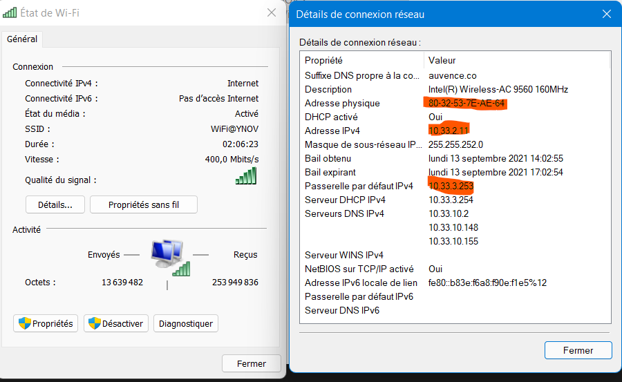
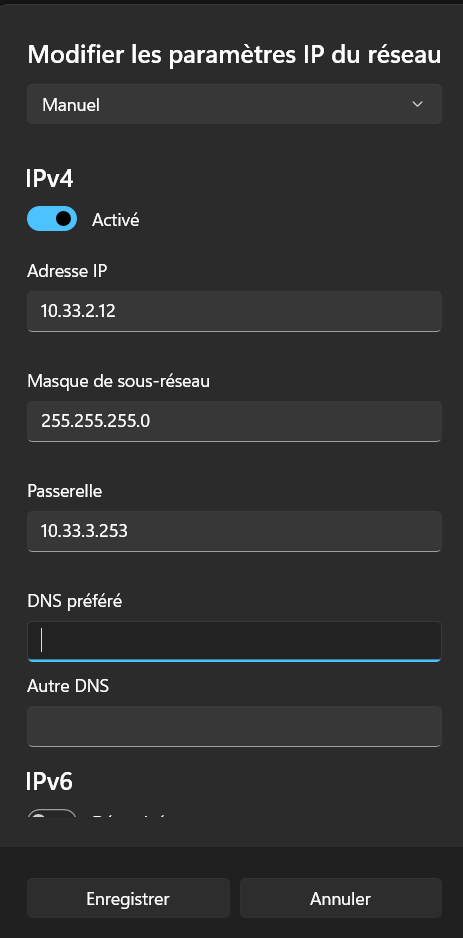
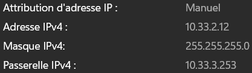
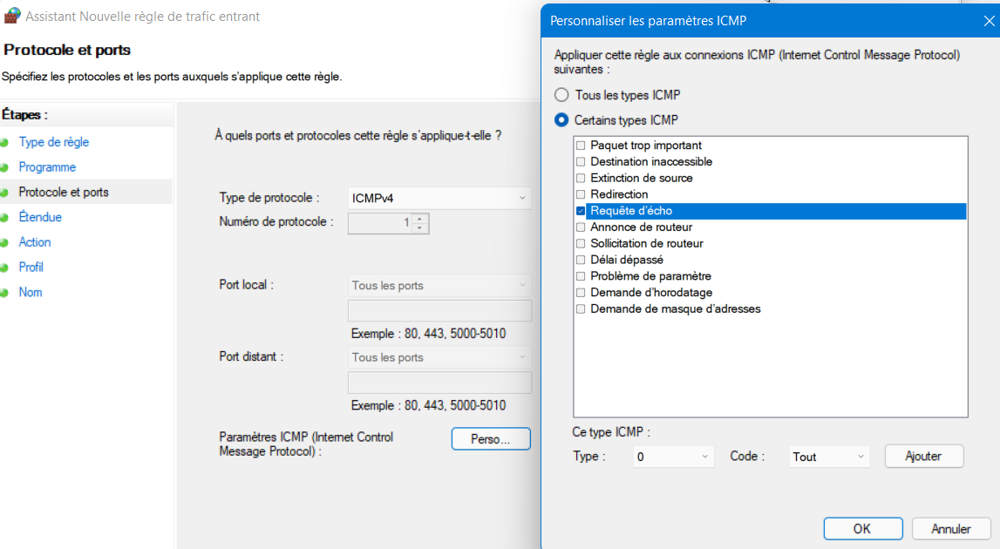
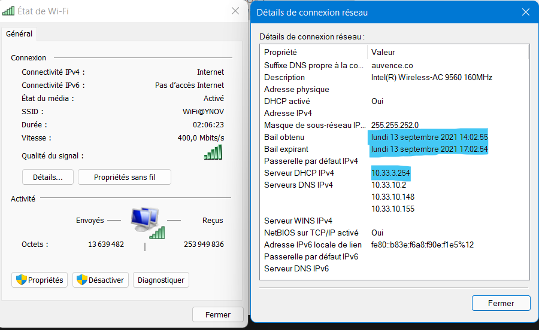
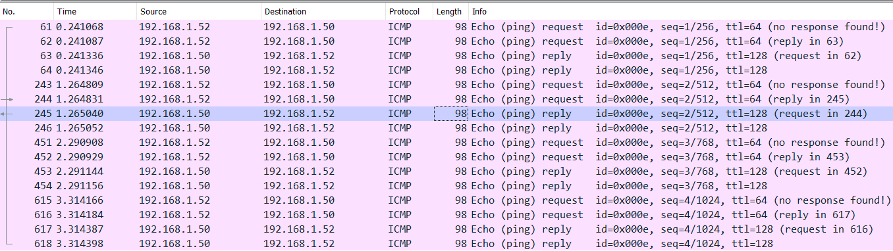
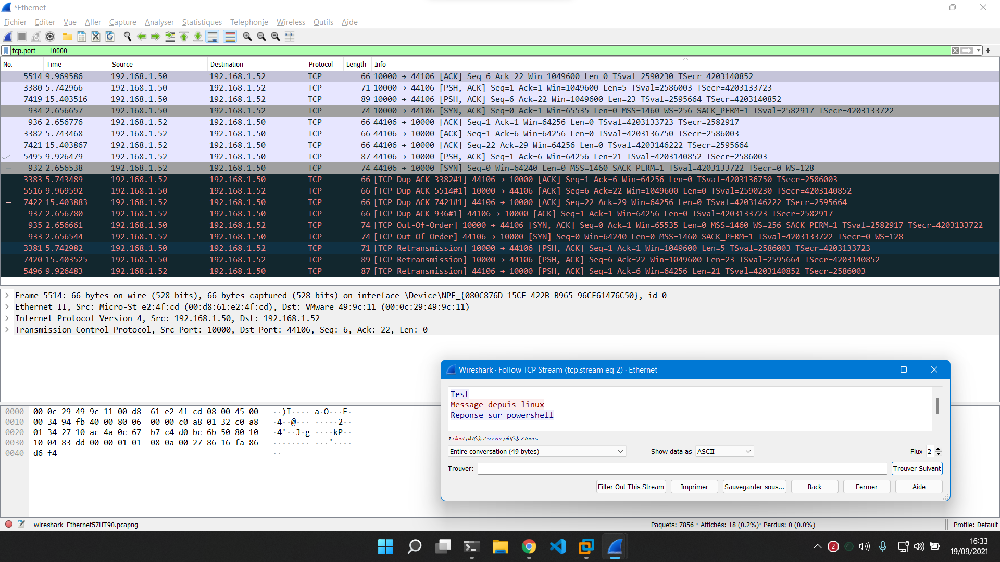

# Compte rendu TP1 - MONTAGNIER Yrlan

## I. Exploration locale en solo
### 1. Affichage d'informations sur la pile TCP/IP locale
#### **🌞 Affichez les infos des cartes réseau de votre PC**

```
$ Get-NetAdapter -physical | Select Name, MacAddress
Name     MacAddress
----     ----------
Wi-Fi    80-32-53-7E-AE-64
Ethernet 00-D8-61-E2-4F-CD

$ ipconfig (Ethernet pas connecté pas d'adresse IP)
Carte réseau sans fil Wi-Fi :
[...]
Adresse IPv4. . . . . . . . . . . . . .: 10.33.2.11
[...]
```

#### **🌞 Affichez votre gateway**

```
$ ipconfig
[...]
Passerelle par défaut. . . . . . . . . : 10.33.3.253
```

#### **🌞 Trouvez comment afficher les informations sur une carte IP (change selon l'OS)**

Sous Windows 11 : Paramètres réseau et internet => WiFi => Propriété du matériel
Ou Panneau de Configuration => Centre réseau et partage => Cartes réseau et on choisit la carte WiFi


#### **🌞 A quoi sert la gateway dans le réseau d'YNOV ?**

Dans le réseau d'Ynov comme dans un LAN chez nous, la passerelle sert à faire la liaison entre le réseau local (celui d'Ynov) avec le réseau internet.

### 2. Modifications des informations

#### A. Modification d'adresse IP (part1)
- **🌞 Utilisez l'interface graphique de votre OS pour changer d'adresse IP**

Mon adresse étant 10.33.2.11, je suis passé en 10.33.2.12


- **🌞 Pourquoi peut on perdre internet**

Je n'ai pas perdu internet personnelement, mais cela aurait pu se passer si j'avais choisie une adresse IP déja utilisée par un autre équipement, on verra sur le prochaine screen la nouvelle IP


#### B. Table ARP
- **🌞 Exploration de la table ARP**

```
$ arp -a
Adresse Internet      Adresse physique      Type
  10.33.2.97            d8-12-65-b5-11-77     dynamique
  10.33.2.255           ff-ff-ff-ff-ff-ff     statique
  10.33.3.253           00-12-00-40-4c-bf     dynamique
  10.33.3.254           00-0e-c4-cd-74-f5     dynamique
  224.0.0.22            01-00-5e-00-00-16     statique
  224.0.0.251           01-00-5e-00-00-fb     statique
  224.0.0.252           01-00-5e-00-00-fc     statique
  224.0.0.253           01-00-5e-00-00-fd     statique
  239.255.255.250       01-00-5e-7f-ff-fa     statique
  255.255.255.255       ff-ff-ff-ff-ff-ff     statique
```
Nous avons vu que l'ip de la passerelle d'ynov est **10.33.3.253**, donc son adresse MAC est : **00-12-00-40-4c-bf**

- **🌞 Et si on remplissait un peu la table ?**

On va ping des adresses du même réseau puis on peut les trouver dans la table ARP.
```
$ ping 10.33.3.109
$ ping 10.33.3.112
$ ping 10.33.3.130

$ arp -a
Adresse Internet      Adresse physique      Type
[...]
  10.33.3.109           38-f9-d3-2f-c2-79     dynamique
  10.33.3.112           3c-06-30-2d-48-0d     dynamique
  10.33.3.130           18-1d-ea-b4-8c-82     dynamique
[...]
```
On a maintenant les adresses MAC correspondantes aux adresses IP qu'on a ping juste avant.

#### C. Nmap
**🌞 Utilisez nmap pour scanner le réseau de votre carte WiFi et trouver une adresse IP libre**
- **Lancer un scan de ping sur le réseau YNOV**

La commande `nmap -sn -PE 10.33.0.0/22` permet de trouver les IP actuellement utilisées sur le réseau d'Ynov
```
$ nmap -sn -PE 10.33.0.0/22
[...]
MAC Address: A0:78:17:B5:63:BB (Apple)
Nmap scan report for 10.33.3.222
Host is up (0.099s latency).

MAC Address: 5C:BA:EF:0B:1D:81 (Chongqing Fugui Electronics)
Nmap scan report for 10.33.3.225
Host is up (0.0040s latency).

MAC Address: 34:2E:B7:49:5A:CF (Intel Corporate)
Nmap scan report for 10.33.3.226
Host is up (0.0050s latency).
[...]
```
- **Afficher la table ARP :**
```
$ arp -a
[...]
10.33.0.3             22-93-d2-7e-9f-1a     dynamique
10.33.0.8             ee-6b-a1-17-e3-b6     dynamique
10.33.0.10            b0-6f-e0-4c-cf-ea     dynamique
10.33.0.35            70-66-55-52-8a-55     dynamique
10.33.0.41            b0-eb-57-82-54-35     dynamique
10.33.0.59            e4-0e-ee-73-73-96     dynamique
[...]
```
#### D. Modification d'adresse IP (part 2)
On a vu sur le scan de ping que 10.33.3.222 et 10.33.3.225 sont utilisées.

Je choisis une ip entre 10.33.3.222 et 10.33.3.225 donc 10.33.3.223, je vais la modifier et vérifier que cela a été pris en compte avec :
```
$ ipconfig
Carte réseau sans fil Wi-Fi :
    [...]
    Adresse IPv4. . . . . . . . . . . . . .: 10.33.3.223
    Passerelle par défaut : 10.33.3.253
```

## II. Exploration locale en duo
### 1. Prérequis
- 2 PCs avec ports RJ45
- 1 câble RJ45
- Firewalls désactivés sur les 2 PC

### 2. Câblage
On connecte un câble Ethernet entre 2PC

### 3. Modification d'adresse IP
#### Modifier l'IP des deux machines pour qu'elles soient dans le même réseau
Nous avons défini nos IP sur 192.168.0.1 et 192.168.0.2, avec un masque en /30 pour avoir 2 IP disponibles.

#### Vérifier à l'aide de commandes que les changements ont pris effet
```
$ yoshi@yoshi:~$ ip a | grep enp3s0
2: enp3s0: <BROADCAST,MULTICAST,UP,LOWER_UP> mtu 1500 qdisc fq_codel state UP group default qlen 1000
    inet 192.168.0.1/30 brd 192.168.0.3 scope global noprefixroute enp3s0
    
$ ipconfig
Carte Ethernet Ethernet :
    Adresse IPv4. . . . . . . . . . . . . .: 192.168.0.2
```
#### Utiliser ping pour tester la connectivité entre les deux machines
```
$ ping 192.168.0.1

Envoi d’une requête 'Ping'  192.168.0.1 avec 32 octets de données :
Réponse de 192.168.0.1 : octets=32 temps=1 ms TTL=64
Réponse de 192.168.0.1 : octets=32 temps=1 ms TTL=64
Réponse de 192.168.0.1 : octets=32 temps=1 ms TTL=64

Statistiques Ping pour 192.168.0.1:
    Paquets : envoyés = 3, reçus = 3, perdus = 0 (perte 0%),
Durée approximative des boucles en millisecondes :
    Minimum = 1ms, Maximum = 1ms, Moyenne = 1ms

$ yoshi@yoshi:~$ ping 192.168.0.2

PING 192.168.0.2 (192.168.0.2) 56(84) bytes of data.
64 bytes from 192.168.0.2: icmp_seq=1 ttl=128 time=1.27 ms
64 bytes from 192.168.0.2: icmp_seq=2 ttl=128 time=1.12 ms
64 bytes from 192.168.0.2: icmp_seq=3 ttl=128 time=1.19 ms
^C
--- 192.168.0.2 ping statistics ---
3 packets transmitted, 3 received, 0% packet loss, time 2003ms
rtt min/avg/max/mdev = 1.118/1.192/1.271/0.062 ms
```
#### Afficher et consulter la table ARP

```
$ arp -a
Interface : 192.168.0.2 --- 0x3
  Adresse Internet      Adresse physique      Type
  192.168.0.1           00-d8-61-e8-40-99     dynamique
  [...]
```

### 4. Utilisation d'un des deux comme gateway
C'est la carte réseau de mon PC qui servait de Gateway, voici le côté client qui passe par mon IP ( 192.168.0.2 )

#### **:sun_with_face: Pour tester la connectivité à internet on fait souvent des requêtes simples vers un serveur internet connu**
- encore une fois, un ping vers un DNS connu comme 1.1.1.1 ou 8.8.8.8 c’est parfait

```
$ ping 1.1.1.1
PING 1.1.1.1 (1.1.1.1) 56(84) bytes of data.
64 bytes from 1.1.1.1: icmp_seq=1 ttl=57 time=19.7 ms
64 bytes from 1.1.1.1: icmp_seq=2 ttl=57 time=20.1 ms
64 bytes from 1.1.1.1: icmp_seq=3 ttl=57 time=20.5 ms
--- 1.1.1.1 ping statistics ---
3 packets transmitted, 3 received, 0% packet loss, time 2003ms
rtt min/avg/max/mdev = 19.705/20.107/20.514/0.330 ms

$ ping 8.8.8.8
PING 8.8.8.8 (8.8.8.8) 56(84) bytes of data.
64 bytes from 8.8.8.8: icmp_seq=1 ttl=114 time=21.4 ms
64 bytes from 8.8.8.8: icmp_seq=2 ttl=114 time=20.2 ms
64 bytes from 8.8.8.8: icmp_seq=3 ttl=114 time=21.4 ms
--- 8.8.8.8 ping statistics ---
3 packets transmitted, 3 received, 0% packet loss, time 2003ms
rtt min/avg/max/mdev = 20.169/20.985/21.412/0.577 ms
```

#### **🌞 Utiliser un traceroute ou tracert pour bien voir que les requêtes passent par la passerelle choisie (l'autre le PC)**

```
$ traceroute -4 8.8.8.8
traceroute to 8.8.8.8 (8.8.8.8), 30 hops max, 60 byte packets
 1  _gateway (192.168.0.2)  1.194 ms  1.129 ms  1.098 ms
 2  * * *
 3  10.33.3.253 (10.33.3.253)  9.630 ms  9.604 ms  9.578 ms
 4  10.33.10.254 (10.33.10.254)  9.551 ms  13.057 ms  13.495 ms
 5  reverse.completel.net (92.103.174.137)  13.467 ms  13.440 ms  13.944 ms
 6  92.103.120.182 (92.103.120.182)  16.237 ms  10.069 ms  10.008 ms
 7  172.19.130.117 (172.19.130.117)  22.050 ms  20.905 ms  21.887 ms
 8  46.218.128.74 (46.218.128.74)  18.867 ms  18.841 ms  19.195 ms
 9  38.147.6.194.rev.sfr.net (194.6.147.38)  20.175 ms  20.149 ms  19.610 ms
10  72.14.194.30 (72.14.194.30)  19.094 ms  19.559 ms  20.065 ms
11  * * *
12  dns.google (8.8.8.8)  19.795 ms  19.780 ms  18.861 ms
```

### 5. Petit chat privé
#### **🌞 Sur le PC serveur qui possède l'IP 192.168.0.2**

```
$ .\nc.exe -l -p 8888
Salut
Ca va
Yup
```
#### **🌞 Sur le PC client qui possède l'IP 192.168.0.1**

```
$ nc 192.168.0.2 8888
Salut
Ca va
Yup
```

#### **🌞 Pour aller un peu plus loin**
On se met en écoute seulement sur l'ip 192.168.0.1 et sur le port 9999

**Sur le PC serveur**
```
$ .\nc.exe -l -p 9999 192.168.0.1
Coucou
Ca marche
!
```
**Sur le PC client**
```
$ nc 192.168.0.2 9999
Coucou
Ca marche
!
```

### 6. Firewall
#### **🌞 Autoriser les ping**
Pare feu avancé => Règle entrante => Protocole ICMPv4


```
$ ping 192.168.0.1

Envoi d’une requête 'Ping'  192.168.0.1 avec 32 octets de données :
Réponse de 192.168.0.1 : octets=32 temps=1 ms TTL=64
Réponse de 192.168.0.1 : octets=32 temps=4 ms TTL=64
Réponse de 192.168.0.1 : octets=32 temps=1 ms TTL=64

Statistiques Ping pour 192.168.0.1:
    Paquets : envoyés = 3, reçus = 3, perdus = 0 (perte 0%),
Durée approximative des boucles en millisecondes :
    Minimum = 1ms, Maximum = 4ms, Moyenne = 2ms
```
#### **🌞 Autoriser le traffic sur le port qu'utilise nc**
Règle entrante et sortante sur port 10000 :


Test de chat sur le port 10000
- **Sur le PC serveur**
```
$ .\nc.exe -l -p 10000
test1
reponse
```
- **Sur le PC client**
```
$ yoshi@yoshi:~$ nc 192.168.0.2 10000
test1
reponse
```

## III. Manipulations d'autres outils/protocoles côté client

### 1. DHCP
#### **🌞 Exploration du DHCP, depuis votre PC**
Pour obtenir les informations sur le serveur DHCP, panneau de configuration => réseau => carte réseau => propriété ou `ipconfig /all`


L'adresse IP du serveur DHCP d'Ynov est 10.33.3.254, et le bail DHCP expirera à 17:02.

### 2. DNS
#### **🌞 Trouver l'adresse IP du serveur DNS que connaît votre ordinateur**
```
$ ipconfig /all
Carte réseau sans fil Wi-Fi :
    [...]
    Serveurs DNS. . . . . . . . . . . . . .: 8.8.8.8
```
J'utilise les serveurs DNS de google, qui sont affichés ici

#### **🌞 Utiliser, en ligne de commande l'outil nslookup pour faire des requêtes DNS à la main**
- Lookup
```
$ nslookup google.com
Serveur :   dns.google
Address:  8.8.8.8

Réponse ne faisant pas autorité :
Nom :    google.com
Addresses:  2a00:1450:4007:80d::200e
            216.58.215.46

$ nslookup ynov.com
Serveur :   dns.google
Address:  8.8.8.8

Réponse ne faisant pas autorité :
Nom :    ynov.com
Address:  92.243.16.143
```
On peut en déduire qu'il est possible de trouver l'adresse IP à partir d'un nom de domaine connu.

L'addresse IP des serveur à qui nous avont fait les requêtes, pour google, est **216.58.215.46** et celle du serveur d'ynov est **92.243.16.143**

- Reverse Lookup
```
$ nslookup 78.74.21.21
Serveur :   dns.google
Address:  8.8.8.8

Nom :    host-78-74-21-21.homerun.telia.com
Address:  78.74.21.21

$ nslookup 92.146.54.88
Serveur :   dns.google
Address:  8.8.8.8

Nom :    apoitiers-654-1-167-88.w92-146.abo.wanadoo.fr
Address:  92.146.54.88
```
Ce que l'on peut en déduire, c'est qu'il est également possible de retrouver un nom de domaine à partir de son adresse IP.
`nslookup 78.74.21.21` nous renvoie sur telia.com. `nslookup 92.146.54.88` renvoie vers un serveur d'orange probablement ( wanadoo.fr )

## IV. Wireshark
### 🌞 Utiliser Wireshark pour observer les trames qui circulent entre vos deux carte Ethernet. Mettez en évidence :
Pour cette partie, il faut préciser que je n'étais plus aux locaux d'ynov, j'ai donc fait la partie sur Wireshark avec une VM configurée avec une carte bridge, qui possède une IP sur le même réseau physique que mon laptop.

#### Un ping entre vous et la passerelle


#### Un netcat entre vous et votre mate, branché en RJ45
```
$ PS C:\Users\yrlan\Desktop\Tools\Utilitaires\netcat-1.11> .\nc64.exe -l -p 10000
Test
Message depuis linux
Reponse sur powershell

$ yrlan@yrlan-virtual-machine:~$ nc 192.168.1.50 10000
Test
Message depuis linux
Reponse sur powershell
```


#### Une requête DNS. Identifiez dans la capture le serveur DNS à qui vous posez la question.
[](/img/DNS.png)
