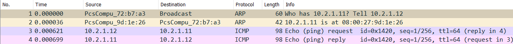
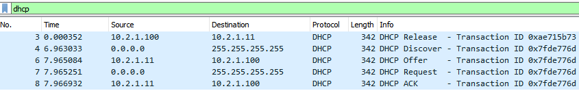

# Compte rendu TP2 Réseaux - MONTAGNIER Yrlan

## Sommaire

- [TP2 : On va router des trucs](#tp2--on-va-router-des-trucs)
  - [Sommaire](#sommaire)
  - [I. ARP](#i-arp)
    - [1. Echange ARP](#1-echange-arp)
    - [2. Analyse de trames](#2-analyse-de-trames)
  - [II. Routage](#ii-routage)
    - [1. Mise en place du routage](#1-mise-en-place-du-routage)
    - [2. Analyse de trames](#2-analyse-de-trames-1)
    - [3. Accès internet](#3-accès-internet)
  - [III. DHCP](#iii-dhcp)
    - [1. Mise en place du serveur DHCP](#1-mise-en-place-du-serveur-dhcp)
    - [2. Analyse de trames](#2-analyse-de-trames-2)

## **I. ARP**
### **1. Echange ARP**
#### **🌞 Générer des requêtes ARP**

- **Effectuer un ping d'une machine à l'autre**
```
[yrlan@node1 ~]$ ping 10.2.1.12
PING 10.2.1.12 (10.2.1.12) 56(84) bytes of data.
64 bytes from 10.2.1.12: icmp_seq=1 ttl=64 time=1.75 ms
64 bytes from 10.2.1.12: icmp_seq=2 ttl=64 time=1.04 ms
64 bytes from 10.2.1.12: icmp_seq=3 ttl=64 time=0.980 ms
^C
--- 10.2.1.12 ping statistics ---
3 packets transmitted, 3 received, 0% packet loss, time 2005ms
rtt min/avg/max/mdev = 0.980/1.256/1.748/0.349 ms
```

- **Observer les tables ARP des deux machines**
```
[yrlan@node1 ~]$ ip n s
10.2.1.1 dev enp0s8 lladdr 0a:00:27:00:00:40 DELAY
10.2.1.12 dev enp0s8 lladdr 08:00:27:72:b7:a3 STALE

[yrlan@node2 ~]$ ip n s
10.2.1.1 dev enp0s8 lladdr 0a:00:27:00:00:40 DELAY
10.2.1.11 dev enp0s8 lladdr 08:00:27:9d:1e:26 REACHABLE
```

- **Repérer l'adresse MAC de node1 dans la table ARP de node2 et vice-versa**

> L'adresse MAC de node1 est **08:00:27:9d:1e:26**.
`? (10.2.1.11) at 08:00:27:9d:1e:26 [ether] on enp0s8`

> L'adresse MAC de node2 est **08:00:27:72:b7:a3**.
`? (10.2.1.12) at 08:00:27:72:b7:a3 [ether] on enp0s8`

- **Prouvez que l'info est correcte (que l'adresse MAC que vous voyez dans la table est bien celle de la machine correspondante)**
    - **Une commande pour voir la table ARP de node1**
    ```
    [yrlan@node1 ~]$ ip n s
    10.2.1.1 dev enp0s8 lladdr 0a:00:27:00:00:40 DELAY
    10.2.1.12 dev enp0s8 lladdr 08:00:27:72:b7:a3 STALE
    ```
    - **Une commande pour voir l'adresse MAC de node2**
    ```
    [yrlan@node2 ~]$ ip a show enp0s8
    2: enp0s8: <BROADCAST,MULTICAST,UP,LOWER_UP> mtu 1500 qdisc fq_codel state UP group default qlen 1000
        link/ether 08:00:27:72:b7:a3 brd ff:ff:ff:ff:ff:ff
        inet 10.2.1.12/24 brd 10.2.1.255 scope global noprefixroute enp0s8
    ```

### **2. Analyse de trames**
#### **🌞Analyse de trames**
- **Utilisez la commande tcpdump pour réaliser une capture de trame**
```
[yrlan@node1 ~]$ sudo tcpdump -i enp0s8 -w tp2_arp.pcap not port 22
dropped privs to tcpdump
tcpdump: listening on enp0s8, link-type EN10MB (Ethernet), capture size 262144 bytes
```

- **Videz vos tables ARP, sur les deux machines, puis effectuez un ping**
```
[yrlan@node1 ~]$ sudo ip neigh flush all
[yrlan@node2 ~]$ sudo ip neigh flush all

[yrlan@node2 ~]$ ping 10.2.1.11
PING 10.2.1.11 (10.2.1.11) 56(84) bytes of data.
64 bytes from 10.2.1.11: icmp_seq=1 ttl=64 time=1.71 ms
64 bytes from 10.2.1.11: icmp_seq=2 ttl=64 time=0.975 ms
64 bytes from 10.2.1.11: icmp_seq=3 ttl=64 time=1.04 ms
64 bytes from 10.2.1.11: icmp_seq=4 ttl=64 time=1.19 ms
^C
--- 10.2.1.11 ping statistics ---
4 packets transmitted, 4 received, 0% packet loss, time 3006ms
rtt min/avg/max/mdev = 0.975/1.230/1.714/0.292 ms
```

- **Stoppez la capture, et exportez-la sur votre hôte pour visualiser avec Wireshark**
```
[yrlan@node1 ~]$ sudo firewall-cmd --add-port=8888/tcp --permanent
sucess
[yrlan@node1 ~]$ sudo dnf install python3
[yrlan@node1 ~]$ sudo python3 -m http.server 8888
Serving HTTP on 0.0.0.0 port 8888 (http://0.0.0.0:8888/) ...
```
> On récupère la capture dans le navigateur à l'adresse http://10.2.1.11:8888/
[tp2_arp.pcap](./Capture/tp2_arp.pcap)

> Pour la suite du TP, j'ai utilisé FileZilla pour récuperer mes captures en SSH

- **Mettez en évidence les trames ARP**


- **Ecrivez, dans l'ordre, les échanges ARP qui ont eu lieu, je veux TOUTES les trames**

| ordre | type trame   | source                      | destination                |
|-------|------------- |-----------------------------|----------------------------|
| 1     | Requête ARP  | `node2` `08:00:27:72:b7:a3` | Broadcast `FF:FF:FF:FF:FF` |
| 2     | Réponse ARP  | `node1` `08:00:27:9d:1e:26` | `node2` `08:00:27:72:b7:a3`|
| 3     | Ping         | `node2` `10.2.1.12`         | `node1` `10.2.1.11`        |
| 4     | Pong         | `node1` `10.2.1.11`         | `node2` `10.2.1.12`        |

## **II. Routage**


| Machine           | NAT ? | `10.2.1.0/24` | `10.2.2.0/24` |
|-------------------|-------|---------------|---------------|
| `router.net2.tp2` | oui   | `10.2.1.254`  | `10.2.2.254`  |
| `node1.net1.tp2`  | no    | `10.2.1.11`   | no            |
| `marcel.net2.tp2` | no    | no            | `10.2.2.12`   |

### **1. Mise en place du routage**
#### **🌞 Activer le routage sur le noeud router.net2.tp2**
```
[yrlan@router ~]$ sudo firewall-cmd --add-masquerade --zone=public --permanent
success
[yrlan@router ~]$ sudo firewall-cmd --reload
success
[yrlan@router ~]$ sudo firewall-cmd --list-all
public (active)
  target: default
  icmp-block-inversion: no
  interfaces: enp0s3 enp0s8 enp0s9
  sources:
  services: cockpit dhcpv6-client ssh
  ports: 8888/tcp
  protocols:
  masquerade: yes
  forward-ports:
  source-ports:
  icmp-blocks:
  rich rules:
```

#### **🌞 Ajouter les routes statiques nécessaires pour que node1.net1.tp2 et marcel.net2.tp2 puissent se ping**
- **On va créer un fichier de configuration pour les routes nommé `route-enp0s8` dans `/etc/sysconfig/network-scripts/`**

    - **1ère machine** (`node1.net1.tp2`)
    ```
    [yrlan@node1 ~]$ cat /etc/sysconfig/network-scripts/route-enp0s8
    10.2.2.0/24 via 10.2.1.254 dev enp0s8
    
    [yrlan@node1 ~]$ ip r s
    10.2.1.0/24 dev enp0s8 proto kernel scope link src 10.2.1.11 metric 100
    10.2.2.0/24 via 10.2.1.254 dev enp0s8 proto static metric 100
    ```
    - **2ème machine** (`marcel.net2.tp2`)
    ```
    [yrlan@marcel ~]$ cat /etc/sysconfig/network-scripts/route-enp0s8
    10.2.1.0/24 via 10.2.2.254 dev enp0s9

    [yrlan@marcel ~]$ ip r s
    10.2.1.0/24 via 10.2.2.254 dev enp0s8 proto static metric 100
    10.2.2.0/24 dev enp0s8 proto kernel scope link src 10.2.2.12 metric 100
    ```

- **Une fois les routes en place, on vérifie avec un ping que les deux machines peuvent se joindre**
    ```
    [yrlan@node1 ~]$ ping marcel.net2.tp2
    PING marcel.net2.tp2 (10.2.2.12) 56(84) bytes of data.
    64 bytes from marcel.net2.tp2 (10.2.2.12): icmp_seq=1 ttl=63 time=1.41 ms
    64 bytes from marcel.net2.tp2 (10.2.2.12): icmp_seq=2 ttl=63 time=1.78 ms
    64 bytes from marcel.net2.tp2 (10.2.2.12): icmp_seq=3 ttl=63 time=1.37 ms

    --- marcel.net2.tp2 ping statistics ---
    3 packets transmitted, 3 received, 0% packet loss, time 2005ms
    rtt min/avg/max/mdev = 1.371/1.519/1.782/0.191 ms

    [yrlan@marcel ~]$ ping node1.net1.tp2
    PING node1.net1.tp2 (10.2.1.11) 56(84) bytes of data.
    64 bytes from node1.net1.tp2 (10.2.1.11): icmp_seq=1 ttl=63 time=1.97 ms
    64 bytes from node1.net1.tp2 (10.2.1.11): icmp_seq=2 ttl=63 time=1.86 ms

    --- node1.net1.tp2 ping statistics ---
    2 packets transmitted, 2 received, 0% packet loss, time 1002ms
    rtt min/avg/max/mdev = 1.855/1.910/1.965/0.055 ms
    ```

### **2. Analyse de trames**
#### **🌞 Analyse des échanges ARP**
- **Videz les tables ARP des trois noeuds ===>** `sudo ip neigh flush all`
- **Effectuez un ping de `node1.net1.tp2` vers `marcel.net2.tp2`**
    ```
    [yrlan@node1 ~]$ ping marcel.net2.tp2
    PING marcel.net2.tp2 (10.2.2.12) 56(84) bytes of data.
    64 bytes from marcel.net2.tp2 (10.2.2.12): icmp_seq=1 ttl=63 time=1.37 ms
    
    --- marcel.net2.tp2 ping statistics ---
    1 packets transmitted, 1 received, 0% packet loss, time 0ms
    rtt min/avg/max/mdev = 1.371/1.371/1.371/0.000 ms
    ```
- **Regardez les tables ARP des trois noeuds**
    - **1ère machine**
    ```
    10.2.2.12 dev enp0s9 lladdr 08:00:27:7a:ca:f3 REACHABLE
    10.2.1.11 dev enp0s8 lladdr 08:00:27:72:b7:a3 REACHABLE
    10.2.1.1 dev enp0s8 lladdr 0a:00:27:00:00:0d REACHABLE
    ```
    - **2ème machine**
    ```
    [yrlan@node1 ~]$ ip n s
    10.2.1.1 dev enp0s8 lladdr 0a:00:27:00:00:0d REACHABLE
    10.2.1.254 dev enp0s8 lladdr 08:00:27:9d:1e:26 REACHABLE
    ```
    - **3ème machine**
    ```
    [yrlan@marcel ~]$ ip n s
    10.2.2.1 dev enp0s8 lladdr 0a:00:27:00:00:16 REACHABLE
    10.2.2.254 dev enp0s8 lladdr 08:00:27:2b:87:ef REACHABLE
    ```
- **Essayez de déduire un peu les échanges ARP qui ont eu lieu**

> Sur la 1ère machine qui sert de routeur, on a une entrée `10.2.1.11` qui est la source du ping **(node1)** et `10.2.2.12` qui est l'IP de destination **(marcel)**

> Sur la 2ème, on a `10.2.1.254`, qui est l'adresse IP de la 1ère interface réseaux du routeur.

> Sur la 3ème, on a `10.2.2.254`, qui est l'adresse IP de la 2ème interface réseaux du routeur.

> **Le ping provenant de `node1` est receptionné par le routeur via sa première interface réseau, puis il va renvoyer ce message via sa 2ème interface réseaux sur le même réseaux que `marcel`**

- **Répétez l'opération précédente (vider les tables, puis ping), en lançant tcpdump sur les 3 noeuds, afin de capturer les échanges depuis les 3 points de vue**
    ```
    $ sudo ip neigh flush all ( sur les 3 VM )
    [yrlan@router ~]$ sudo tcpdump -i enp0s8 -w tp2_routage_router.pcap not port 22
    [yrlan@node1 ~]$ sudo tcpdump -i enp0s8 -w tp2_routage_node1.pcap not port 22
    [yrlan@marcel ~]$ sudo tcpdump -i enp0s8 -w tp2_routage_marcel.pcap not port 22

    [yrlan@node1 ~]$ ping marcel.net2.tp2
    PING marcel.net2.tp2 (10.2.2.12) 56(84) bytes of data.
    64 bytes from marcel.net2.tp2 (10.2.2.12): icmp_seq=1 ttl=63 time=2.38 ms

    --- marcel.net2.tp2 ping statistics ---
    1 packets transmitted, 1 received, 0% packet loss, time 0ms
    rtt min/avg/max/mdev = 2.382/2.382/2.382/0.000 ms
    ```
> Pour cette partie, j'ai utilisé la fonction **fusionner** de WireShark afin d'avoir une vue d'ensemble sur ce qu'il s'est passé

- **Ecrivez, dans l'ordre, les échanges ARP qui ont eu lieu, puis le ping et le pong, je veux TOUTES les trames**

| ordre | type trame  | IP source | MAC source                   | IP destination | MAC destination             |
|-------|-------------|-----------|------------------------------|----------------|---------------------------- |
| 1     | Requête ARP | x         | `node1` `08:00:27:72:b7:a3`  | x              | Broadcast `FF:FF:FF:FF:FF`  |
| 2     | Réponse ARP | x         | `router` `08:00:27:9d:1e:26` | x              | `node1` `08:00:27:72:b7:a3` |
| 3     | Ping        | 10.2.1.11 | `node1` `08:00:27:72:b7:a3`  | 10.2.2.12      | `router` `08:00:27:9d:1e:26`|
| 4     | Requête ARP | x         | `router` `08:00:27:2b:87:ef` | x              | Broadcast `FF:FF:FF:FF:FF`  |
| 5     | Réponse ARP | x         | `marcel` `08:00:27:7a:ca:f3` | x              | `router` `08:00:27:2b:87:ef`|
| 6     | Ping        | 10.2.2.254| `router` `08:00:27:2b:87:ef` | 10.2.2.12      | `marcel` `08:00:27:7a:ca:f3`|
| 7     | Pong        | 10.2.2.12 | `marcel` `08:00:27:7a:ca:f3` | 10.2.2.254     | `router` `08:00:27:2b:87:ef`|
| 8     | Pong        | 10.2.2.12 | `router` `08:00:27:9d:1e:26` | 10.2.1.11      | `node1` `08:00:27:72:b7:a3` |

[tp2_routage_fusion.pcap](./Capture/tp2_routage_fusion.pcap)

### 3. Accès internet
#### **🌞Donnez un accès internet à vos machines**
- **Le routeur a déjà un accès internet**
    ```
    [yrlan@router ~]$ ping 8.8.8.8
    PING 8.8.8.8 (8.8.8.8) 56(84) bytes of data.
    64 bytes from 8.8.8.8: icmp_seq=1 ttl=114 time=22.2 ms

    --- 8.8.8.8 ping statistics ---
    1 packets transmitted, 1 received, 0% packet loss, time 0ms
    rtt min/avg/max/mdev = 22.172/22.172/22.172/0.000 ms
    ```

- **Ajoutez une route par défaut à node1.net1.tp2 et marcel.net2.tp2**
    ```
    [yrlan@node1 ~]$ ip r s
    default via 10.2.1.254 dev enp0s8 proto static metric 100
    
    [yrlan@node1 ~]$ cat /etc/sysconfig/network
    # Created by anaconda
    GATEWAY=10.2.1.254
    ```
    - **Vérifiez que vous avez accès internet avec un ping**
    - **Le ping doit être vers une IP, PAS un nom de domaine**
    ```
    [yrlan@node1 ~]$ ping 8.8.8.8
    PING 8.8.8.8 (8.8.8.8) 56(84) bytes of data.
    64 bytes from 8.8.8.8: icmp_seq=1 ttl=113 time=21.6 ms

    --- 8.8.8.8 ping statistics ---
    1 packets transmitted, 1 received, 0% packet loss, time 0ms
    rtt min/avg/max/mdev = 21.597/21.597/21.597/0.000 ms
    ```
    
- **Donnez leur aussi l'adresse d'un serveur DNS qu'ils peuvent utiliserr**
    - **Vérifiez que vous avez une résolution de noms qui fonctionne avec dig**
    ```
    [yrlan@node1 ~]$ sudo cat /etc/resolv.conf
    # Generated by NetworkManager
    search lan net1.tp2
    nameserver 192.168.1.254
    nameserver 1.1.1.1

    [yrlan@node1 ~]$ dig ynov.com

    ; <<>> DiG 9.11.26-RedHat-9.11.26-4.el8_4 <<>> ynov.com
    ;; global options: +cmd
    ;; Got answer:
    ;; ->>HEADER<<- opcode: QUERY, status: NOERROR, id: 11199
    ;; flags: qr rd ra; QUERY: 1, ANSWER: 1, AUTHORITY: 0, ADDITIONAL: 1

    ;; OPT PSEUDOSECTION:
    ; EDNS: version: 0, flags:; udp: 1232
    ;; QUESTION SECTION:
    ;ynov.com.                      IN      A

    ;; ANSWER SECTION:
    ynov.com.               10097   IN      A       92.243.16.143

    ;; Query time: 24 msec
    ;; SERVER: 1.1.1.1#53(1.1.1.1)
    ;; WHEN: Thu Sep 23 16:43:14 CEST 2021
    ;; MSG SIZE  rcvd: 53
    ```

    - **Puis avec un ping vers un nom de domaine**
    ```
    [yrlan@node1 ~]$ ping ynov.com
    PING ynov.com (92.243.16.143) 56(84) bytes of data.
    64 bytes from xvm-16-143.dc0.ghst.net (92.243.16.143): icmp_seq=1 ttl=52 time=19.8 ms
    64 bytes from xvm-16-143.dc0.ghst.net (92.243.16.143): icmp_seq=2 ttl=52 time=18.6 ms
    64 bytes from xvm-16-143.dc0.ghst.net (92.243.16.143): icmp_seq=3 ttl=52 time=18.7 ms
    
    --- ynov.com ping statistics ---
    3 packets transmitted, 3 received, 0% packet loss, time 6056ms
    rtt min/avg/max/mdev = 18.576/19.027/19.790/0.565 ms
    ```

#### **🌞Analyse de trames**
- **Effectuez un ping vers `8.8.8.8` depuis `node1.net1.tp2`**
    ```
    [yrlan@node1 ~]$ ping 8.8.8.8
    PING 8.8.8.8 (8.8.8.8) 56(84) bytes of data.
    64 bytes from 8.8.8.8: icmp_seq=1 ttl=112 time=13.6 ms
    
    --- 8.8.8.8 ping statistics ---
    1 packets transmitted, 1 received, 0% packet loss, time 0ms
    rtt min/avg/max/mdev = 13.621/13.621/13.621/0.000 ms    
    ```
- **Capturez le ping depuis node1.net1.tp2 avec tcpdump : `sudo tcpdump -i enp0s8 -w tp2_routage_internet.pcap not port 22`**

[tp2_routage_internet.pcap](./Capture/tp2_routage_internet.pcap)
- **Analysez un ping aller et le retour qui correspond et mettez dans un tableau :**

| ordre | type trame | IP source           | MAC source                  | IP destination      | MAC destination              | 
|-------|------------|---------------------|-----------------------------|---------------------|------------------------------|
| 1     | ping       | `node1` `10.2.1.11` | `node1` `08:00:27:72:b7:a3` | `8.8.8.8`           | `router` `08:00:27:9d:1e:26` |
| 2     | pong       | `8.8.8.8`           | `router` `08:00:27:9d:1e:26`| `node1` `10.2.1.11` | `node1` `08:00:27:72:b7:a3`  | 
 

## **III. DHCP**

| Machine           | NAT ? | `10.2.1.0/24`              | `10.2.2.0/24` |
|-------------------|-------|----------------------------|---------------|
| `router.net2.tp2` | oui   | `10.2.1.254`               | `10.2.2.254`  |
| `node1.net1.tp2`  | no    | `10.2.1.11`                | no            |
| `node2.net1.tp2`  | no    | oui mais pas d'IP statique | no            |
| `marcel.net2.tp2` | no    | no                         | `10.2.2.12`   |

### **1. Mise en place du serveur DHCP**
#### **🌞 Sur la machine `node1.net1.tp2`, vous installerez et configurerez un serveur DHCP (go Google "rocky linux dhcp server")**
- **Installation du serveur sur `node1.net1.tp2`**
    ```
    [yrlan@node1 ~]$ sudo dnf -y install dhcp-server
    [yrlan@node1 ~]$ sudo firewall-cmd --zone=public --permanent --add-service=dhcp
    success
    [yrlan@node1 ~]$ sudo firewall-cmd --reload
    success
    
    [yrlan@node1 ~]$ sudo cat /etc/dhcp/dhcpd.conf
    #
    # DHCP Server Configuration file.
    #   see /usr/share/doc/dhcp-server/dhcpd.conf.example
    #   see dhcpd.conf(5) man page
    #
    # Bail de 24H, max 48H
    default-lease-time 86400;
    max-lease-time 172800;
    #
    # Déclaration du réseau (10.2.1.0/24) + range
    subnet 10.2.1.0 netmask 255.255.255.0 {
            range                             10.2.1.100 10.2.1.199;
    }
    ```
- **Créer une machine `node2.net1.tp2`**
- **Faites lui récupérer une IP en DHCP à l'aide de votre serveur**
    ```
    [yrlan@node1 ~]$ sudo systemctl enable dhcpd
    [yrlan@node1 ~]$ sudo systemctl start dhcpd
    
    [yrlan@node2 ~]$ sudo dhclient
    [yrlan@node2 ~]$ ip a show enp0s8
    2: enp0s8: <BROADCAST,MULTICAST,UP,LOWER_UP> mtu 1500 qdisc fq_codel state UP group default qlen 1000
        link/ether 08:00:27:cb:c0:f1 brd ff:ff:ff:ff:ff:ff
        inet 10.2.1.100/24 brd 10.2.1.255 scope global dynamic enp0s8
           valid_lft 85931sec preferred_lft 85931sec
        inet6 fe80::a00:27ff:fecb:c0f1/64 scope link
           valid_lft forever preferred_lft forever
    ```

#### **🌞 Améliorer la configuration du DHCP**
- **Ajoutez de la configuration à votre DHCP pour qu'il donne aux clients, en plus de leur IP :**
    - **Une route par défaut**
    - **Un serveur DNS à utiliser**
    ```
    [yrlan@node1 ~]$ sudo cat /etc/dhcp/dhcpd.conf
    #
    # DHCP Server Configuration file.
    #   see /usr/share/doc/dhcp-server/dhcpd.conf.example
    #   see dhcpd.conf(5) man page
    #
    # Bail de 24H, max 48H
    default-lease-time 86400;
    max-lease-time 172800;
    # Déclaration d'un réseau
    subnet 10.2.1.0 netmask 255.255.255.0 {
            range                           10.2.1.100 10.2.1.199;
            option domain-name-servers      8.8.8.8; # DNS à utiliser
            option routers                  10.2.1.254; # Route par défaut
    }

    [yrlan@node1 ~]$ sudo systemctl restart dhcpd
    [yrlan@node2 ~]$ sudo dhclient -r
    [yrlan@node2 ~]$ sudo dhclient
    ```

- **Récupérez de nouveau une IP en DHCP sur node2.net1.tp2 pour tester :**
    - **Node2.net1.tp2 doit avoir une IP**
        - **Vérifier avec une commande qu'il a récupéré son IP**
        ```
        [yrlan@node2 ~]$ ip a show enp0s8
        2: enp0s8: <BROADCAST,MULTICAST,UP,LOWER_UP> mtu 1500 qdisc fq_codel state UP group default qlen 1000
        link/ether 08:00:27:cb:c0:f1 brd ff:ff:ff:ff:ff:ff
        inet 10.2.1.100/24 brd 10.2.1.255 scope global dynamic enp0s8
           valid_lft 86354sec preferred_lft 86354sec
        inet6 fe80::a00:27ff:fecb:c0f1/64 scope link
           valid_lft forever preferred_lft forever
        ```
        - **Vérifier qu'il peut ping sa passerelle**
        ```
        [yrlan@node2 ~]$ ping 10.2.1.254
        PING 10.2.1.254 (10.2.1.254) 56(84) bytes of data.
        64 bytes from 10.2.1.254: icmp_seq=1 ttl=64 time=0.434 ms
        64 bytes from 10.2.1.254: icmp_seq=2 ttl=64 time=0.904 ms
        
        --- 10.2.1.254 ping statistics ---
        2 packets transmitted, 2 received, 0% packet loss, time 1047ms
        rtt min/avg/max/mdev = 0.434/0.669/0.904/0.235 ms
        ```
    - **Il doit avoir une route par défaut**
        - **Vérifier la présence de la route avec une commande**
        ```
        [yrlan@node2 ~]$ ip r s
        default via 10.2.1.254 dev enp0s8
        10.2.1.0/24 dev enp0s8 proto kernel scope link src 10.2.1.100
        ```
        - **Vérifier que la route fonctionne avec un ping vers une IP**
        ```
        [yrlan@node2 ~]$ ping 8.8.8.8
        PING 8.8.8.8 (8.8.8.8) 56(84) bytes of data.
        64 bytes from 8.8.8.8: icmp_seq=1 ttl=112 time=13.6 ms
        64 bytes from 8.8.8.8: icmp_seq=2 ttl=112 time=11.5 ms
        
        --- 8.8.8.8 ping statistics ---
        2 packets transmitted, 2 received, 0% packet loss, time 1002ms
        rtt min/avg/max/mdev = 11.545/12.590/13.636/1.051 ms
        ```

    - **Il doit connaître l'adresse d'un serveur DNS pour avoir de la résolution de noms**
        - **Vérifier avec la commande dig que ça fonctionne**
        ```
        [yrlan@node2 ~]$ dig ynov.com

        ; <<>> DiG 9.11.26-RedHat-9.11.26-4.el8_4 <<>> ynov.com
        ;; global options: +cmd
        ;; Got answer:
        ;; ->>HEADER<<- opcode: QUERY, status: NOERROR, id: 45739
        ;; flags: qr rd ra; QUERY: 1, ANSWER: 1, AUTHORITY: 0, ADDITIONAL: 1

        ;; OPT PSEUDOSECTION:
        ; EDNS: version: 0, flags:; udp: 512
        ;; QUESTION SECTION:
        ;ynov.com.                      IN      A

        ;; ANSWER SECTION:
        ynov.com.               10800   IN      A       92.243.16.143

        ;; Query time: 23 msec
        ;; SERVER: 8.8.8.8#53(8.8.8.8)
        ;; WHEN: Fri Sep 24 00:37:22 CEST 2021
        ;; MSG SIZE  rcvd: 53
        ```
        - **Vérifier un ping vers un nom de domaine**
        ```
        [yrlan@node2 ~]$ ping ynov.com
        PING ynov.com (92.243.16.143) 56(84) bytes of data.
        64 bytes from xvm-16-143.dc0.ghst.net (92.243.16.143): icmp_seq=1 ttl=49 time=12.10 ms
        64 bytes from xvm-16-143.dc0.ghst.net (92.243.16.143): icmp_seq=2 ttl=49 time=12.1 ms
        
        --- ynov.com ping statistics ---
        2 packets transmitted, 2 received, 0% packet loss, time 1001ms
        rtt min/avg/max/mdev = 12.081/12.528/12.975/0.447 ms
        ```

### **2. Analyse de trames**
#### **🌞 Analyse de trames**
- **Videz les tables ARP des machines concernées**
    `sudo ip neigh flush all`
- **Lancer une capture à l'aide de tcpdump afin de capturer un échange DHCP**
    - **Choisissez vous-mêmes l'interface où lancer la capture**
    ```
    [yrlan@node2 ~]$ sudo tcpdump -i enp0s8 -w tp2_arp
    ```
- **Répéter une opération de renouvellement de bail DHCP, et demander une nouvelle IP afin de générer un échange DHCP**
    ```
    [yrlan@node2 ~]$ sudo dhclient -r
    [yrlan@node2 ~]$ sudo dhclient
    ```
- **Exportez le fichier `.pcap`**

[tp2_dhcp.pcap](./Capture/tp2_dhcp.pcap)

- **Mettez en évidence l'échange DHCP DORA (Discover, Offer, Request, Acknowledge)**



- **Ecrivez, dans l'ordre, les échanges ARP + DHCP qui ont lieu, je veux TOUTES les trames utiles pour l'échange**

| ordre | type trame       | IP source           | MAC source                  | IP destination | MAC destination               |
|-------|------------------|---------------------|-----------------------------|----------------|-------------------------------|
| 1     | ARP              | ...                 | `node2` `08:00:27:cb:c0:f1` | ...            | Broadcast `ff:ff:ff:ff:ff:ff` |
| 2     | ARP              | ...                 | `node1` `08:00:27:72:b7:a3` | ...            | `node2` `08:00:27:cb:c0:f1`   |
| 3     | DHCP Release     | 10.2.1.100          | `node2` `08:00:27:cb:c0:f1` | 10.2.1.11      | `node1` `08:00:27:72:b7:a3`   |
| 4     | DHCP Discover    | 0.0.0.0             | `node2` `08:00:27:cb:c0:f1` | 255.255.255.255| Broadcast `ff:ff:ff:ff:ff:ff` |
| 5     | DHCP Offer       | 10.2.1.11           | `node1` `08:00:27:72:b7:a3` | 10.2.1.100     | `node2` `08:00:27:cb:c0:f1`   |
| 6     | DHCP Request     | 0.0.0.0             | `node2` `08:00:27:cb:c0:f1` | 255.255.255.255| Broadcast `ff:ff:ff:ff:ff:ff` |
| 7     | DHCP Acknowledge | 10.2.1.100          | `node1` `08:00:27:72:b7:a3` | 10.2.1.100     | `node2` `08:00:27:cb:c0:f1`   |
