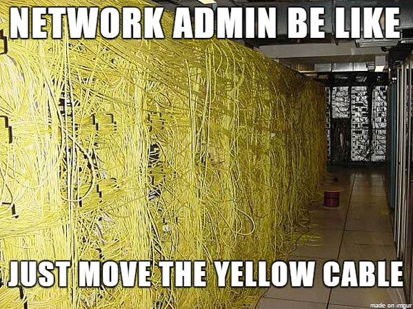

# TP4 : Vers un réseau d'entreprise

On va utiliser GNS3 dans ce TP pour se rapprocher d'un cas réel. On va focus sur l'aspect routing/switching, avec du matériel Cisco. On va aussi mettre en place des VLANs.

# Sommaire

- [TP4 : Vers un réseau d'entreprise](#tp4--vers-un-réseau-dentreprise)
- [Sommaire](#sommaire)
- [I. Dumb switch](#i-dumb-switch)
  - [1. Topologie 1](#1-topologie-1)
  - [2. Adressage topologie 1](#2-adressage-topologie-1)
  - [3. Setup topologie 1](#3-setup-topologie-1)
- [II. VLAN](#ii-vlan)
  - [1. Topologie 2](#1-topologie-2)
  - [2. Adressage topologie 2](#2-adressage-topologie-2)
    - [3. Setup topologie 2](#3-setup-topologie-2)
- [III. Routing](#iii-routing)
  - [1. Topologie 3](#1-topologie-3)
  - [2. Adressage topologie 3](#2-adressage-topologie-3)
  - [3. Setup topologie 3](#3-setup-topologie-3)
- [IV. NAT](#iv-nat)
  - [1. Topologie 4](#1-topologie-4)
  - [2. Adressage topologie 4](#2-adressage-topologie-4)
  - [3. Setup topologie 4](#3-setup-topologie-4)

# I. Dumb switch

## 1. Topologie 1


## 2. Adressage topologie 1

| Node  | IP            |
|-------|---------------|
| `pc1` | `10.1.1.1/24` |
| `pc2` | `10.1.1.2/24` |

## 3. Setup topologie 1

#### **🌞 Commençons simple**

- **Définissez les IPs statiques sur les deux VPCS**
    ```
    PC1> ip 10.1.1.1/24
    Checking for duplicate address...
    PC1 : 10.1.1.1 255.255.255.0

    PC2> ip 10.1.1.2/24
    Checking for duplicate address...
    PC2 : 10.1.1.2 255.255.255.0

    PC1> show ip

    NAME        : PC1[1]
    IP/MASK     : 10.1.1.1/24
    GATEWAY     : 0.0.0.0
    DNS         :
    MAC         : 00:50:79:66:68:00
    LPORT       : 20006
    RHOST:PORT  : 127.0.0.1:20007
    MTU         : 1500
    ----------------------------------------------------
    PC2> show ip

    NAME        : PC2[1]
    IP/MASK     : 10.1.1.2/24
    GATEWAY     : 0.0.0.0
    DNS         :
    MAC         : 00:50:79:66:68:01
    LPORT       : 20042
    RHOST:PORT  : 127.0.0.1:20043
    MTU         : 1500
    ```

- `ping` un VPCS depuis l'autre
    ```
    PC1> ping 10.1.1.2 -c 3

    84 bytes from 10.1.1.2 icmp_seq=1 ttl=64 time=5.545 ms
    84 bytes from 10.1.1.2 icmp_seq=2 ttl=64 time=8.601 ms
    84 bytes from 10.1.1.2 icmp_seq=3 ttl=64 time=6.452 ms
    ```

> Jusque là, ça devrait aller. Noter qu'on a fait aucune conf sur le switch. Tant qu'on ne fait rien, c'est une bête multiprise.

# II. VLAN

**Le but dans cette partie va être de tester un peu les *VLANs*.**

On va rajouter **un troisième client** qui, bien que dans le même réseau, sera **isolé des autres grâce aux *VLANs***.

**Les *VLANs* sont une configuration à effectuer sur les *switches*.** C'est les *switches* qui effectuent le blocage.

Le principe est simple :

- déclaration du VLAN sur tous les switches
  - un VLAN a forcément un ID (un entier)
  - bonne pratique, on lui met un nom
- sur chaque switch, on définit le VLAN associé à chaque port
  - genre "sur le port 35, c'est un client du VLAN 20 qui est branché"

## 1. Topologie 2


## 2. Adressage topologie 2

| Node  | IP            | VLAN |
|-------|---------------|------|
| `pc1` | `10.1.1.1/24` | 10   |
| `pc2` | `10.1.1.2/24` | 10   |
| `pc3` | `10.1.1.3/24` | 20   |

### 3. Setup topologie 2

🌞 **Adressage**

- définissez les IPs statiques sur tous les VPCS
- vérifiez avec des `ping` que tout le monde se ping

🌞 **Configuration des VLANs**

- référez-vous [à la section VLAN du mémo Cisco](../../cours/memo/memo_cisco.md#8-vlan)
- déclaration des VLANs sur le switch `sw1`
- ajout des ports du switches dans le bon VLAN (voir [le tableau d'adressage de la topo 2 juste au dessus](#2-adressage-topologie-2))
  - ici, tous les ports sont en mode *access* : ils pointent vers des clients du réseau

🌞 **Vérif**

- `pc1` et `pc2` doivent toujours pouvoir se ping
- `pc3` ne ping plus personne

# III. Routing

Dans cette partie, on va donner un peu de sens aux VLANs :

- un pour les serveurs du réseau
  - on simulera ça avec un p'tit serveur web
- un pour les admins du réseau
- un pour les autres random clients du réseau

Cela dit, il faut que tout ce beau monde puisse se ping, au moins joindre le réseau des serveurs, pour accéder au super site-web.

**Bien que bloqué au niveau du switch à cause des VLANs, le trafic pourra passer d'un VLAN à l'autre grâce à un routeur.**

Il assurera son job de routeur traditionnel : router entre deux réseaux. Sauf qu'en plus, il gérera le changement de VLAN à la volée.

## 1. Topologie 3


## 2. Adressage topologie 3

Les réseaux et leurs VLANs associés :

| Réseau    | Adresse       | VLAN associé |
|-----------|---------------|--------------|
| `clients` | `10.1.1.0/24` | 11           |
| `servers` | `10.2.2.0/24` | 12           |
| `routers` | `10.3.3.0/24` | 13           |

L'adresse des machines au sein de ces réseaux :

| Node               | `clients`       | `admins`        | `servers`       |
|--------------------|-----------------|-----------------|-----------------|
| `pc1.clients.tp4`  | `10.1.1.1/24`   | x               | x               |
| `pc2.clients.tp4`  | `10.1.1.2/24`   | x               | x               |
| `adm1.admins.tp4`  | x               | `10.2.2.1/24`   | x               |
| `web1.servers.tp4` | x               | x               | `10.3.3.1/24`   |
| `r1`               | `10.1.1.254/24` | `10.2.2.254/24` | `10.3.3.254/24` |

## 3. Setup topologie 3

🖥️ VM `web1.servers.tp4`, déroulez la [Checklist VM Linux](#checklist-vm-linux) dessus

🌞 **Adressage**

- définissez les IPs statiques sur toutes les machines **sauf le *routeur***

🌞 **Configuration des VLANs**

- référez-vous au [mémo Cisco](../../cours/memo/memo_cisco.md#8-vlan)
- déclaration des VLANs sur le switch `sw1`
- ajout des ports du switches dans le bon VLAN (voir [le tableau d'adressage de la topo 2 juste au dessus](#2-adressage-topologie-2))
- il faudra ajouter le port qui pointe vers le *routeur* comme un *trunk* : c'est un port entre deux équipements réseau (un *switch* et un *routeur*)

---

➜ **Pour le *routeur***

- référez-vous au [mémo Cisco](../../cours/memo/memo_cisco.md)
- ici, on va avoir besoin d'un truc très courant pour un *routeur* : qu'il porte plusieurs IP sur une unique interface
  - avec Cisco, on crée des "sous-interfaces" sur une interface
  - et on attribue une IP à chacune de ces sous-interfaces
- en plus de ça, il faudra l'informer que, pour chaque interface, elle doit être dans un VLAN spécifique

Pour ce faire, un exemple. On attribue deux IPs `192.168.1.254/24` VLAN 11 et `192.168.2.254` VLAN12 à un *routeur*. L'interface concernée sur le *routeur* est `fastEthernet 0/0` :

```cisco
# conf t

(config)# interface fastEthernet 0/0.10
R1(config-subif)# encapsulation dot1Q 10
R1(config-subif)# ip addr 192.168.1.254 255.255.255.0 
R1(config-subif)# exit

(config)# interface fastEthernet 0/0.20
R1(config-subif)# encapsulation dot1Q 20
R1(config-subif)# ip addr 192.168.2.254 255.255.255.0 
R1(config-subif)# exit
```

🌞 **Config du *routeur***

- attribuez ses IPs au *routeur*
  - 3 sous-interfaces, chacune avec son IP et un VLAN associé

🌞 **Vérif**

- tout le monde doit pouvoir ping le routeur sur l'IP qui est dans son réseau
- en ajoutant une route vers les réseaux, ils peuvent se ping entre eux
  - ajoutez une route par défaut sur les VPCS
  - ajoutez une route par défaut sur la machine virtuelle
  - testez des `ping` entre les réseaux

# IV. NAT

On va ajouter une fonctionnalité au routeur : le NAT.

On va le connecter à internet (simulation du fait d'avoir une IP publique) et il va faire du NAT pour permettre à toutes les machines du réseau d'avoir un accès internet.



## 1. Topologie 4


## 2. Adressage topologie 4

Les réseaux et leurs VLANs associés :

| Réseau    | Adresse       | VLAN associé |
|-----------|---------------|--------------|
| `clients` | `10.1.1.0/24` | 11           |
| `servers` | `10.2.2.0/24` | 12           |
| `routers` | `10.3.3.0/24` | 13           |

L'adresse des machines au sein de ces réseaux :

| Node               | `clients`       | `admins`        | `servers`       |
|--------------------|-----------------|-----------------|-----------------|
| `pc1.clients.tp4`  | `10.1.1.1/24`   | x               | x               |
| `pc2.clients.tp4`  | `10.1.1.2/24`   | x               | x               |
| `adm1.admins.tp4`  | x               | `10.2.2.1/24`   | x               |
| `web1.servers.tp4` | x               | x               | `10.3.3.1/24`   |
| `r1`               | `10.1.1.254/24` | `10.2.2.254/24` | `10.3.3.254/24` |

## 3. Setup topologie 4

🌞 **Ajoutez le noeud Cloud à la topo**

- branchez à `eth1` côté Cloud
- côté routeur, il faudra récupérer un IP en DHCP (voir [le mémo Cisco](../../cours/memo/memo_cisco.md))
- vous devriez pouvoir `ping 1.1.1.1`

🌞 **Configurez le NAT**

- référez-vous [à la section NAT du mémo Cisco](../../cours/memo/memo_cisco.md#7-configuration-dun-nat-simple)

🌞 **Test**

- ajoutez une route par défaut (si c'est pas déjà fait)
  - sur les VPCS
  - sur la machine Linux
- configurez l'utilisation d'un DNS
  - sur les VPCS
  - sur la machine Linux
- vérifiez un `ping` vers un nom de domaine

