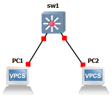
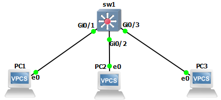
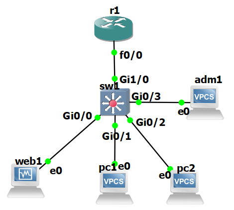

# TP4 : Vers un réseau d'entreprise

On va utiliser GNS3 dans ce TP pour se rapprocher d'un cas réel. On va focus sur l'aspect routing/switching, avec du matériel Cisco. On va aussi mettre en place des VLANs.

# Sommaire

- [TP4 : Vers un réseau d'entreprise](#tp4--vers-un-réseau-dentreprise)
- [Sommaire](#sommaire)
- [I. Dumb switch](#i-dumb-switch)
  - [1. Topologie 1](#1-topologie-1)
  - [2. Adressage topologie 1](#2-adressage-topologie-1)
  - [3. Setup topologie 1](#3-setup-topologie-1)
- [II. VLAN](#ii-vlan)
  - [1. Topologie 2](#1-topologie-2)
  - [2. Adressage topologie 2](#2-adressage-topologie-2)
    - [3. Setup topologie 2](#3-setup-topologie-2)
- [III. Routing](#iii-routing)
  - [1. Topologie 3](#1-topologie-3)
  - [2. Adressage topologie 3](#2-adressage-topologie-3)
  - [3. Setup topologie 3](#3-setup-topologie-3)
- [IV. NAT](#iv-nat)
  - [1. Topologie 4](#1-topologie-4)
  - [2. Adressage topologie 4](#2-adressage-topologie-4)
  - [3. Setup topologie 4](#3-setup-topologie-4)

# I. Dumb switch

## 1. Topologie 1



## 2. Adressage topologie 1

| Node  | IP            |
|-------|---------------|
| `pc1` | `10.1.1.1/24` |
| `pc2` | `10.1.1.2/24` |

## 3. Setup topologie 1

#### **🌞 Commençons simple**
- **Définissez les IPs statiques sur les deux VPCS**
    ```
    # On définit les addresses IP
    PC1> ip 10.1.1.1/24
    Checking for duplicate address...
    PC1 : 10.1.1.1 255.255.255.0

    PC2> ip 10.1.1.2/24
    Checking for duplicate address...
    PC2 : 10.1.1.2 255.255.255.0

    # Vérification
    PC1> show ip

    NAME        : PC1[1]
    IP/MASK     : 10.1.1.1/24
    GATEWAY     : 0.0.0.0
    DNS         :
    MAC         : 00:50:79:66:68:00
    LPORT       : 20006
    RHOST:PORT  : 127.0.0.1:20007
    MTU         : 1500
    ```
- `ping` un VPCS depuis l'autre
    ```
    PC1> ping 10.1.1.2 -c 3

    84 bytes from 10.1.1.2 icmp_seq=1 ttl=64 time=5.545 ms
    84 bytes from 10.1.1.2 icmp_seq=2 ttl=64 time=8.601 ms
    84 bytes from 10.1.1.2 icmp_seq=3 ttl=64 time=6.452 ms
    -------------------------------------------------------
    PC2> ping 10.1.1.1 -c 2

    84 bytes from 10.1.1.1 icmp_seq=1 ttl=64 time=11.604 ms
    84 bytes from 10.1.1.1 icmp_seq=2 ttl=64 time=10.701 ms
    ```

> Jusque là, ça devrait aller. Noter qu'on a fait aucune conf sur le switch. Tant qu'on ne fait rien, c'est une bête multiprise.

# II. VLAN

## 1. Topologie 2



## 2. Adressage topologie 2

| Node  | IP            | VLAN |
|-------|---------------|------|
| `pc1` | `10.1.1.1/24` | 10   |
| `pc2` | `10.1.1.2/24` | 10   |
| `pc3` | `10.1.1.3/24` | 20   |

### 3. Setup topologie 2

#### **🌞 Adressage**

- **Définissez les IPs statiques sur tous les VPCS**
    ```
    PC3> ip 10.1.1.3/24
    ```
- **Vérifiez avec des `ping` que tout le monde se ping**
    ```
    PC2> ping 10.1.1.3 -c 4

    84 bytes from 10.1.1.3 icmp_seq=1 ttl=64 time=8.053 ms
    84 bytes from 10.1.1.3 icmp_seq=2 ttl=64 time=5.151 ms
    84 bytes from 10.1.1.3 icmp_seq=3 ttl=64 time=6.817 ms
    84 bytes from 10.1.1.3 icmp_seq=4 ttl=64 time=2.377 ms
    --------------------------------------------------------
    PC3> ping 10.1.1.1 -c 4

    84 bytes from 10.1.1.1 icmp_seq=1 ttl=64 time=7.373 ms
    84 bytes from 10.1.1.1 icmp_seq=2 ttl=64 time=6.256 ms
    84 bytes from 10.1.1.1 icmp_seq=3 ttl=64 time=20.608 ms
    84 bytes from 10.1.1.1 icmp_seq=4 ttl=64 time=14.735 ms
    ```

#### **🌞 Configuration des VLANs**

- **Référez-vous à la section VLAN du mémo Cisco**
- **Déclaration des VLANs sur le switch `sw1`**
    ```
    # Passage en mode priviligié puis mode config
    Switch>enable 
    Switch#conf t
    
    # Création des 2 vlan + leurs nom
    Switch(config)#vlan 10  
    Switch(config-vlan)#name MyVlan
    Switch(config-vlan)#exit
    
    Switch(config)#vlan 20
    Switch(config-vlan)#name restrict
    Switch(config-vlan)#exit
    
    # Vérifications
    Switch(config)#do show vlan br
    VLAN Name                             Status    Ports
    ---- -------------------------------- --------- -------------------------------
    [...]
    10   MyVlan                           active    
    20   restrict                         active    
    [...]
    ```
- **Ajout des ports du switches dans le bon VLAN (voir [le tableau d'adressage de la topo 2 juste au dessus](#2-adressage-topologie-2))**
    - **Ici, tous les ports sont en mode *access* : ils pointent vers des clients du réseau**
    ```
    # PC1 dans vlan10
    Switch(config)#interface GigabitEthernet0/1
    Switch(config-if)#switchport mode access
    Switch(config-if)#switchport access vlan 10
    Switch(config-if)#exit

    # PC2 dans vlan10
    Switch(config)#interface GigabitEthernet0/2
    Switch(config-if)#switchport mode access
    Switch(config-if)#switchport access vlan 10
    Switch(config-if)#exit

    # PC3 dans vlan20
    Switch(config)#interface GigabitEthernet0/3
    Switch(config-if)#switchport mode access
    Switch(config-if)#switchport access vlan 20
    Switch(config-if)#exit

    # Vérifications
    Switch(config)#do show vlan br
    VLAN Name                             Status    Ports
    ---- -------------------------------- --------- -------------------------------
    [...]
    10   MyVlan                           active    Gi0/1, Gi0/2
    20   restrict                         active    Gi0/3
    [...]
    ```

#### **🌞 Vérif**

- **`pc1` et `pc2` doivent toujours pouvoir se ping**
    ```
    PC1> ping 10.1.1.2 -c 3

    84 bytes from 10.1.1.2 icmp_seq=1 ttl=64 time=15.862 ms
    84 bytes from 10.1.1.2 icmp_seq=2 ttl=64 time=4.685 ms
    84 bytes from 10.1.1.2 icmp_seq=3 ttl=64 time=2.569 ms
    ```
- **`pc3` ne ping plus personne**
    ```
    PC3> ping 10.1.1.1

    host (10.1.1.1) not reachable

    PC3> ping 10.1.1.2

    host (10.1.1.2) not reachable
    ```

# III. Routing

## 1. Topologie 3



## 2. Adressage topologie 3

Les réseaux et leurs VLANs associés :

| Réseau    | Adresse       | VLAN associé |
|-----------|---------------|--------------|
| `clients` | `10.1.1.0/24` | 11           |
| `servers` | `10.2.2.0/24` | 12           |
| `routers` | `10.3.3.0/24` | 13           |

L'adresse des machines au sein de ces réseaux :

| Node               | `clients`       | `admins`        | `servers`       |
|--------------------|-----------------|-----------------|-----------------|
| `pc1.clients.tp4`  | `10.1.1.1/24`   | x               | x               |
| `pc2.clients.tp4`  | `10.1.1.2/24`   | x               | x               |
| `adm1.admins.tp4`  | x               | `10.2.2.1/24`   | x               |
| `web1.servers.tp4` | x               | x               | `10.3.3.1/24`   |
| `r1`               | `10.1.1.254/24` | `10.2.2.254/24` | `10.3.3.254/24` |

## 3. Setup topologie 3

> **🖥️ VM `web1.servers.tp4`, déroulez la [Checklist VM Linux](#checklist-vm-linux) dessus**

#### **🌞 Adressage**

- **Définissez les IPs statiques sur toutes les machines sauf le *routeur***
    ```
    pc1> ip 10.1.1.1/24
    Checking for duplicate address...
    pc1 : 10.1.1.1 255.255.255.0

    pc2> ip 10.1.1.2/24
    Checking for duplicate address...
    pc2 : 10.1.1.2 255.255.255.0

    adm1> ip 10.2.2.1/24
    Checking for duplicate address...
    adm1 : 10.2.2.1 255.255.255.0
    
    [yrlan@web1 ~]$ sudo cat /etc/sysconfig/network-scripts/ifcfg-enp0s3
    [...]
    BOOTPROTO=static
    IPADDR=10.3.3.1
    NETMASK=255.255.255.0
    [...]
    ```

#### **🌞 Configuration des VLANs**

- **Référez-vous au [mémo Cisco](../../cours/memo/memo_cisco.md#8-vlan)**
- **Déclaration des VLANs sur le switch `sw1`**
    ```
    Switch(config)#vlan 11
    Switch(config-vlan)#name clients
    Switch(config-vlan)#exit

    Switch(config)#vlan 12
    Switch(config-vlan)#name admins
    Switch(config-vlan)#exit

    Switch(config)#vlan 13
    Switch(config-vlan)#name servers
    Switch(config-vlan)#exit
    ```
- **Ajout des ports du switches dans le bon VLAN (voir [le tableau d'adressage de la topo 2 juste au dessus](#2-adressage-topologie-2))**
    ```
    # Port de web1
    Switch(config)#interface GigabitEthernet0/0
    Switch(config-if)#switchport mode access
    Switch(config-if)#switchport access vlan 13
    Switch(config-if)#exit
    
    # Port du pc1
    Switch(config)#interface GigabitEthernet0/1
    Switch(config-if)#switchport mode access
    Switch(config-if)#switchport access vlan 11
    Switch(config-if)#exit

    # Port du pc2
    Switch(config)#interface GigabitEthernet0/2
    Switch(config-if)#switchport mode access
    Switch(config-if)#switchport access vlan 11
    Switch(config-if)#exit

    # Port de adm1
    Switch(config)#interface GigabitEthernet0/3
    Switch(config-if)#switchport mode access
    Switch(config-if)#switchport access vlan 12
    Switch(config-if)#exit
    
    # Vérifications
    Switch(config)#do show vlan br

    VLAN Name                             Status    Ports
    ---- -------------------------------- --------- -------------------------------
    [...]
    11   clients                          active    Gi0/1, Gi0/2
    12   admins                           active    Gi0/3
    13   servers                          active    Gi0/0
    [...]
    ```
- **Il faudra ajouter le port qui pointe vers le *routeur* comme un *trunk* : c'est un port entre deux équipements réseau (un *switch* et un *routeur*)**
    ```
    # Port du routeur
    Switch(config)#interface GigabitEthernet1/0
    Switch(config-if)#switchport trunk encapsulation dot1q
    Switch(config-if)#switchport mode trunk
    Switch(config-if)#switchport trunk allowed vlan add 11,12,13
    Switch(config-if)#exit

    # Vérifications + Sauvegarde config
    Switch(config)#do show int tr

    Port        Mode             Encapsulation  Status        Native vlan
    Gi1/0       on               802.1q         trunking      1

    Port        Vlans allowed on trunk
    Gi1/0       1-4094

    Port        Vlans allowed and active in management domain
    Gi1/0       1,11-13

    Port        Vlans in spanning tree forwarding state and not pruned
    Gi1/0       1,11-13
    
    Switch#copy running-config startup-config
    Destination filename [startup-config]?
    Building configuration...
    Compressed configuration from 3839 bytes to 1721 bytes[OK]
    Switch#
    *Oct 23 17:01:24.271: %GRUB-5-CONFIG_WRITING: GRUB configuration is being updated on disk. Please wait...
    *Oct 23 17:01:25.340: %GRUB-5-CONFIG_WRITTEN: GRUB configuration was written to disk successfully.
    ```
---

➜ **Pour le *routeur***

#### **🌞 Config du *routeur***

- **Attribuez ses IPs au *routeur***
    - 3 sous-interfaces, chacune avec son IP et un VLAN associé
    ```
    R1#conf t

    R1(config)#interface fastEthernet 0/0.11
    R1(config-subif)#encapsulation dot1Q 11
    R1(config-subif)#ip addr 10.1.1.254 255.255.255.0 
    R1(config-subif)#exit

    (config)#interface fastEthernet 0/0.12
    R1(config-subif)#encapsulation dot1Q 12
    R1(config-subif)#ip addr 10.2.2.254 255.255.255.0 
    R1(config-subif)#exit

    (config)#interface fastEthernet 0/0.13
    R1(config-subif)#encapsulation dot1Q 13
    R1(config-subif)#ip addr 10.3.3.254 255.255.255.0 
    R1(config-subif)#exit

    # Allumer l'interface réseau
    R1(config)#interface FastEthernet0/0
    R1(config-if)#no shut
    R1(config-if)#exit
    
    # Vérifications + sauvegarde config
    R1(config)#do show ip int br
    Interface                  IP-Address      OK? Method Status                Protocol
    FastEthernet0/0            unassigned      YES NVRAM  up                    up
    FastEthernet0/0.11         10.1.1.254      YES NVRAM  up                    up
    FastEthernet0/0.12         10.2.2.254      YES NVRAM  up                    up
    FastEthernet0/0.13         10.3.3.254      YES NVRAM  up                    up
    
    R1(config)#do copy running-config startup-config
    ```

#### **🌞 Vérif**

- **Tout le monde doit pouvoir ping le routeur sur l'IP qui est dans son réseau**
    ```
    pc1> ping 10.1.1.254 -c 2

    84 bytes from 10.1.1.254 icmp_seq=1 ttl=255 time=30.358 ms
    84 bytes from 10.1.1.254 icmp_seq=2 ttl=255 time=23.413 ms
    ------------------------------------------------------------
    adm1> ping 10.2.2.254 -c 2

    84 bytes from 10.2.2.254 icmp_seq=1 ttl=255 time=5.938 ms
    84 bytes from 10.2.2.254 icmp_seq=2 ttl=255 time=15.768 ms
    ------------------------------------------------------------
  [yrlan@web1 ~]$ ping 10.3.3.254 -c 3
    PING 10.3.3.254 (10.3.3.254) 56(84) bytes of data.
    64 bytes from 10.3.3.254: icmp_seq=1 ttl=255 time=44.2 ms
    64 bytes from 10.3.3.254: icmp_seq=2 ttl=255 time=22.0 ms
    64 bytes from 10.3.3.254: icmp_seq=3 ttl=255 time=15.1 ms

    --- 10.3.3.254 ping statistics ---
    3 packets transmitted, 3 received, 0% packet loss, time 2003ms
    rtt min/avg/max/mdev = 15.146/27.114/44.166/12.380 ms  
    ```
- **En ajoutant une route vers les réseaux, ils peuvent se ping entre eux**
    - **Ajoutez une route par défaut sur les VPCS**
    ```
    pc1> ip 10.1.1.1/24 10.1.1.254
    Checking for duplicate address...
    pc1 : 10.1.1.1 255.255.255.0 gateway 10.1.1.254

    pc2> ip 10.1.1.2/24 10.1.1.254
    Checking for duplicate address...
    pc1 : 10.1.1.2 255.255.255.0 gateway 10.1.1.254

    adm1> ip 10.2.2.1/24 10.2.2.254
    Checking for duplicate address...
    adm1 : 10.2.2.1 255.255.255.0 gateway 10.2.2.254
    
    # Sur tous VPC's pour save la config :
    VPC's> wr
    Saving startup configuration to startup.vpc
    .  done
    ```
	- **Ajoutez une route par défaut sur la machine virtuelle**
    ```
    [yrlan@web1 ~]$ sudo cat /etc/sysconfig/network-scripts/ifcfg-enp0s3 | grep GATEWAY
    GATEWAY=10.3.3.254
    [yrlan@web1 ~]$ ip r s | grep default
    default via 10.3.3.254 dev enp0s3 proto static metric 100
    ```
	- **Testez des `ping` entre les réseaux**

    > **La 1ère fois, il y'a eut un timeout pour le 1er ping, car la machine fais un ARP broadcast pour connaitre la mac de destination, souvent, le temps qu'elle obtienne la réponse est trop long donc le 1er ping affiche un timeout**
    ```
    pc1> ping 10.2.2.1 -c 3

    10.2.2.1 icmp_seq=1 timeout
    84 bytes from 10.3.3.1 icmp_seq=2 ttl=63 time=35.981 ms
    84 bytes from 10.3.3.1 icmp_seq=3 ttl=63 time=36.401 ms
    -------------------------------------------------------
    adm1> ping 10.3.3.1 -c 3

    10.3.3.1 icmp_seq=1 timeout
    84 bytes from 10.3.3.1 icmp_seq=2 ttl=63 time=48.270 ms
    84 bytes from 10.3.3.1 icmp_seq=3 ttl=63 time=26.424 ms
    -------------------------------------------------------
    [yrlan@web1 ~]$ ping 10.1.1.2 -c 3
    PING 10.1.1.2 (10.1.1.2) 56(84) bytes of data.
    64 bytes from 10.1.1.2: icmp_seq=2 ttl=63 time=35.8 ms
    64 bytes from 10.1.1.2: icmp_seq=3 ttl=63 time=37.0 ms

    --- 10.1.1.2 ping statistics ---
    3 packets transmitted, 2 received, 33.3333% packet loss, time 2006ms
    rtt min/avg/max/mdev = 35.828/36.415/37.003/0.617 ms
    ```

# IV. NAT

On va ajouter une fonctionnalité au routeur : le NAT.

On va le connecter à internet (simulation du fait d'avoir une IP publique) et il va faire du NAT pour permettre à toutes les machines du réseau d'avoir un accès internet.

## 1. Topologie 4


## 2. Adressage topologie 4

Les réseaux et leurs VLANs associés :

| Réseau    | Adresse       | VLAN associé |
|-----------|---------------|--------------|
| `clients` | `10.1.1.0/24` | 11           |
| `servers` | `10.2.2.0/24` | 12           |
| `routers` | `10.3.3.0/24` | 13           |

L'adresse des machines au sein de ces réseaux :

| Node               | `clients`       | `admins`        | `servers`       |
|--------------------|-----------------|-----------------|-----------------|
| `pc1.clients.tp4`  | `10.1.1.1/24`   | x               | x               |
| `pc2.clients.tp4`  | `10.1.1.2/24`   | x               | x               |
| `adm1.admins.tp4`  | x               | `10.2.2.1/24`   | x               |
| `web1.servers.tp4` | x               | x               | `10.3.3.1/24`   |
| `r1`               | `10.1.1.254/24` | `10.2.2.254/24` | `10.3.3.254/24` |

## 3. Setup topologie 4

🌞 **Ajoutez le noeud Cloud à la topo**

- branchez à `eth1` côté Cloud
- côté routeur, il faudra récupérer un IP en DHCP (voir [le mémo Cisco](../../cours/memo/memo_cisco.md))
- vous devriez pouvoir `ping 1.1.1.1`

🌞 **Configurez le NAT**

- référez-vous [à la section NAT du mémo Cisco](../../cours/memo/memo_cisco.md#7-configuration-dun-nat-simple)

🌞 **Test**

- ajoutez une route par défaut (si c'est pas déjà fait)
  - sur les VPCS
  - sur la machine Linux
- configurez l'utilisation d'un DNS
  - sur les VPCS
  - sur la machine Linux
- vérifiez un `ping` vers un nom de domaine